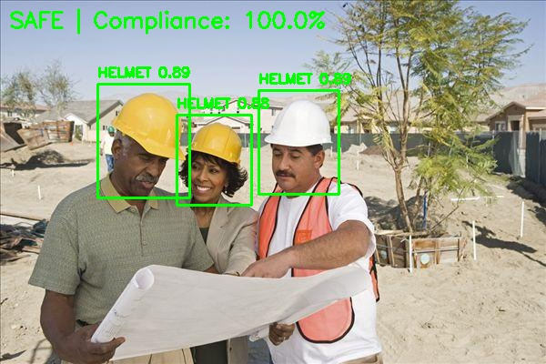

# ⛑️ Helmet Safety Detection — MLOps & Production Deployment

> YOLOv8 PPE compliance detection API containerized with Docker, deployed on AWS EC2, and automated with GitHub Actions CI/CD.


---

## 🌍 Live Demo

| Endpoint | URL |
|---|---|
| Swagger UI | http://3.106.128.58/docs |
| API Home | http://3.106.128.58 |
| Health Check | http://3.106.128.58/health |

> Live API running on AWS EC2 — upload any construction site image and get real-time helmet compliance results.

---

## 1. Project Overview

This project extends the [Helmet Safety Detection model (Project 4)](https://github.com/ahamedkafeel22/helmet-safety-detection) into a production MLOps system.

The focus is **engineering infrastructure**, not model development:
- Packaging a trained YOLOv8 model as a REST API
- Containerizing with Docker for environment consistency
- Deploying to AWS EC2 cloud infrastructure
- Routing traffic through Nginx reverse proxy
- Automating deployments via GitHub Actions CI/CD

---

## 2. Key Features

- ⛑️ YOLOv8 object detection model for helmet compliance (98.2% mAP50)
- ⚡ FastAPI REST API for real-time inference (~0.6s per image)
- 🐳 Docker containerization for reproducible deployment
- 🔀 Nginx reverse proxy for production traffic routing
- ☁️ AWS EC2 cloud hosting (Ubuntu 24.04, t2.micro)
- 🔄 Automated CI/CD pipeline — deploy in 17 seconds on every git push
- 📖 Live Swagger API documentation at `/docs`
- 📋 Structured logging per request (timestamp, inference time, detections)

---

## 3. Example Detection



> Green boxes = helmet detected (compliant) | Red boxes = no helmet (violation)
> Image processed via POST `/predict` endpoint — response includes compliance %, bounding boxes, and confidence scores.

---

## 4. System Architecture

```
                ┌───────────────┐
                │    Client     │
                │  (Browser /   │
                │   REST User)  │
                └───────┬───────┘
                        │  HTTP Request
                        ▼
                ┌───────────────┐
                │     Nginx     │  ← AWS EC2 (t2.micro)
                │ Reverse Proxy │    Port 80 → 8000
                └───────┬───────┘
                        │
                        ▼
                ┌───────────────┐
                │  FastAPI App  │
                │   (Uvicorn)   │
                └───────┬───────┘
                        │
                        ▼
                ┌───────────────┐
                │ YOLOv8 Model  │
                │  Inference    │
                │  ~0.6s/image  │
                └───────┬───────┘
                        │
                        ▼
                ┌───────────────┐
                │ JSON Response │
                │ Helmet Status │
                │ Compliance %  │
                └───────────────┘
```

---

## 5. Deployment Pipeline (CI/CD)

```
Developer pushes code to GitHub (main branch)
        │
        ▼
GitHub Actions CI/CD pipeline triggered automatically
        │
        ▼
Secure SSH connection established to AWS EC2
        │
        ▼
Pull latest repository code (git pull)
        │
        ▼
Stop and remove old Docker container
        │
        ▼
Rebuild Docker image with updated code
        │
        ▼
Start new container (--restart always)
        │
        ▼
Nginx routes traffic to updated FastAPI API
        │
        ▼
✅ Updated API live in ~17 seconds
```

**Trigger:** Every push to `main` branch auto-deploys to production.

---

## 6. Model Performance

| Metric | Value |
|---|---|
| Model | YOLOv8n (nano) |
| Training Dataset | 3,396 construction site images |
| Validation Set | 1,413 images |
| Classes | Helmet, Head (no helmet), Person |
| **Helmet mAP50** | **98.2%** |
| **Head mAP50** | **96.4%** |
| Inference Time | ~0.6s per image (CPU) |
| Parameters | 3,006,233 |

> Model trained on Google Colab with Tesla T4 GPU. Full training details in [Project 4 repo](https://github.com/ahamedkafeel22/helmet-safety-detection).

---

## 7. Project Structure

```
helmet-safety-mlops/
│
├── app/
│   ├── main.py          # FastAPI application + endpoints
│   ├── inference.py     # YOLOv8 model loading + detection logic
│   ├── compliance.py    # Compliance scoring calculation
│   ├── utils.py         # Structured logging configuration
│   └── __init__.py
│
├── models/
│   └── best.pt          # Trained YOLOv8n weights
│
├── .github/
│   └── workflows/
│       └── deploy.yml   # GitHub Actions CI/CD pipeline
│
├── Dockerfile           # Container build instructions
├── .dockerignore        # Docker build exclusions
├── requirements.txt     # Python dependencies
└── README.md
```

---

## 8. API Endpoints

| Method | Endpoint | Description |
|---|---|---|
| GET | `/` | Service status + model metadata |
| POST | `/predict` | Upload image → compliance result |
| GET | `/health` | Container health check |

### Example Request

```bash
curl -X POST http://3.106.128.58/predict \
  -H "Content-Type: multipart/form-data" \
  -F "file=@construction_site.jpg"
```

### Example Response

```json
{
  "model_version": "v1.0",
  "compliance_%": 100,
  "status": "SAFE",
  "helmet_count": 6,
  "violations": 0,
  "total_workers": 6,
  "inference_time_s": 0.616,
  "detections": [
    {
      "class": "helmet",
      "confidence": 0.897,
      "bbox": [36, 104, 95, 168]
    }
  ],
  "timestamp": "2026-03-05 11:37:56"
}
```

---

## 9. Infrastructure Stack

| Component | Technology | Details |
|---|---|---|
| Cloud Provider | AWS EC2 | t2.micro, Free Tier |
| Operating System | Ubuntu 24.04 LTS | |
| Containerization | Docker 28.2.2 | |
| Reverse Proxy | Nginx | Port 80 → 8000 |
| API Framework | FastAPI + Uvicorn | |
| ML Framework | YOLOv8n (Ultralytics) | |
| CI/CD | GitHub Actions | Auto-deploy on push |
| Storage | 20GB EBS Volume | |

---

## 10. Logging

Every API request logs structured output to `logs/api.log`:

```
2026-03-04 11:37:56 | INFO | Loading model from models/best.pt
2026-03-04 11:37:56 | INFO | Model loaded successfully
2026-03-04 11:37:56 | INFO | Received image: site_photo.jpg
2026-03-04 11:37:57 | INFO | Inference complete | time=0.616s | helmets=6 | violations=0
```

Fields logged per request: timestamp, image name, inference time, helmet count, violation count.

---

## 11. How to Run Locally

```bash
# Clone repo
git clone https://github.com/ahamedkafeel22/helmet-safety-mlops.git
cd helmet-safety-mlops

# Build Docker image
docker build -t helmet-api .

# Run container
docker run -p 8000:8000 helmet-api

# Access Swagger UI
http://127.0.0.1:8000/docs
```

---

## 12. Environment Variables

| Variable | Default | Description |
|---|---|---|
| `MODEL_PATH` | `models/best.pt` | Path to YOLOv8 weights |

Override at runtime:
```bash
docker run -e MODEL_PATH=models/custom.pt -p 8000:8000 helmet-api
```

---

## 13. Limitations & Future Work

- HTTPS/SSL not configured — HTTP only (production would need SSL certificate)
- Single EC2 instance — no horizontal scaling or load balancing
- Model weights stored inside container — should be loaded from AWS S3
- No API authentication or rate limiting
- Future: Docker Hub registry + AWS ECS/EKS for scalable deployment

---

## 👤 Author

**Syed Kafeel Ahamed**

Finance professional with 6+ years of accounting experience transitioning into Data Science and MLOps.

🔗 [LinkedIn](https://www.linkedin.com/in/syed-kafeel-ahamed-ab465036b) | [GitHub](https://github.com/ahamedkafeel22) | [Model Repo (Project 4)](https://github.com/ahamedkafeel22/helmet-safety-detection)
